# CMS Core — Modular Headless Platform

[](https://nodejs.org)
[](https://www.typescriptlang.org/)
[](https://fastify.dev)
[](https://react.dev)
[](https://nextjs.org)
[](https://tailwindcss.com)
[](https://zod.dev)
[](https://www.docker.com/)
[](#-testing--code-quality)

A modular, production-ready headless CMS and application platform built with **Fastify 5** and **Next.js 16 (React 19)**. Features are organized into self-contained plugins that can be enabled or disabled at runtime per project without modifying or forking core code.

---

## 💡 Core Philosophy

- **Minimal Core:** Handles only shared essentials — plugin lifecycle, dependency injection, session authentication, and database adapters.
- **Isolated 3-Tier Plugins:** Each plugin owns its Fastify API routes, Zod schemas, React admin views, and RBAC permissions. Plugins never import each other directly.
- **Zero-Fork Runtime Toggles:** Enable or disable features per project via database flags without code changes or forks.
- **Contract-First Design:** Core services and plugins interact strictly through TypeScript interfaces (`IDatabase`, `ICache`, `ILogger`, `IHookManager`).

---

## 📸 Screenshots & Showcase

### 🛡️ Admin Control Plane (`Next.js 16` + `React 19` + `Tailwind CSS v4`)

|                                                Dashboard                                                 |                                              Plugin Manager                                               |
| :------------------------------------------------------------------------------------------------------: | :-------------------------------------------------------------------------------------------------------: |
| 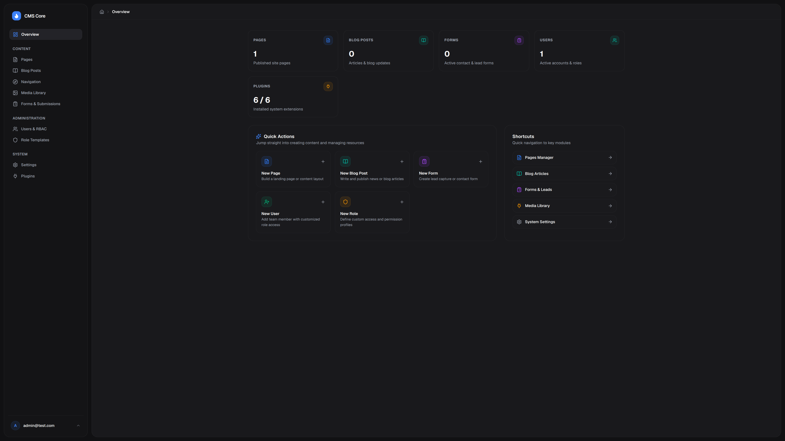<br><sub>System overview and activity metrics</sub> | 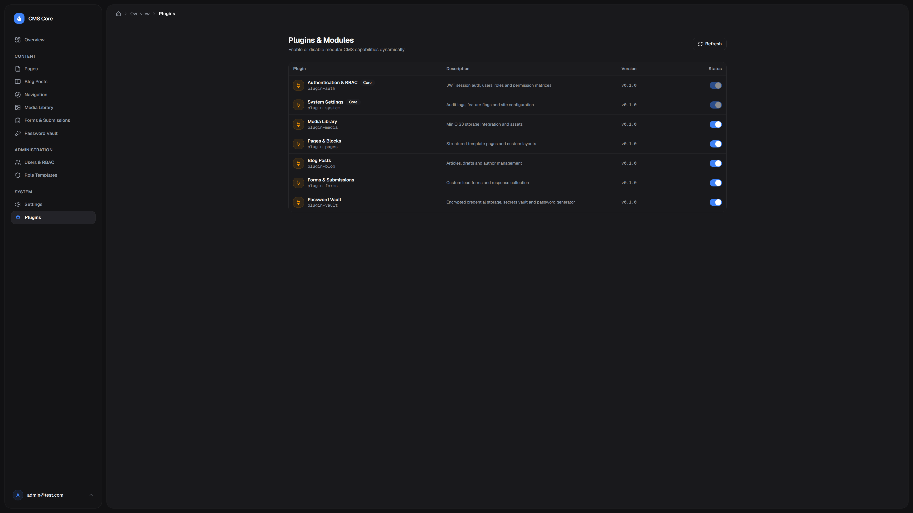<br><sub>Runtime plugin toggles and system status</sub> |

|                                           Page Builder                                            |                                           Form Builder                                            |
| :-----------------------------------------------------------------------------------------------: | :-----------------------------------------------------------------------------------------------: |
| 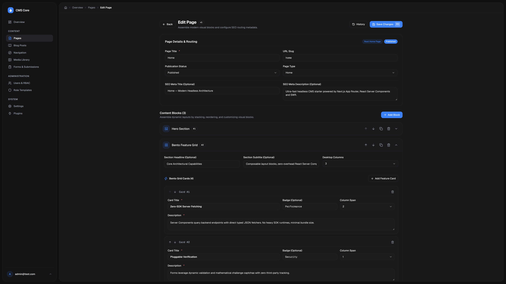<br><sub>Visual block editor and page layouts</sub> | 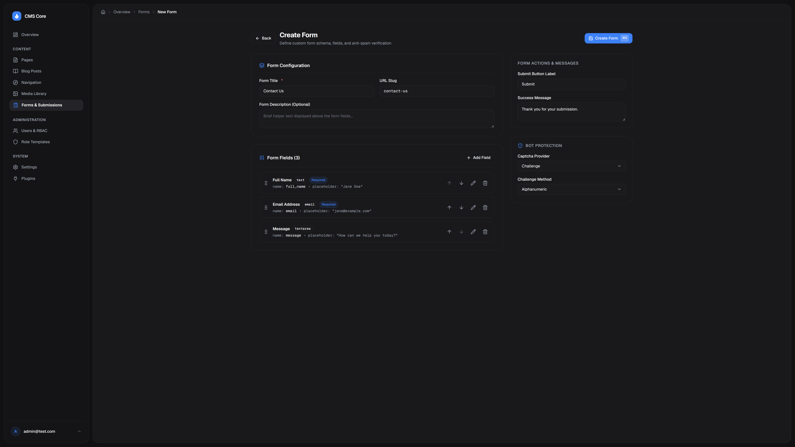<br><sub>Form schema designer, submissions, and Excel export</sub> |

|                                                   Blog Posts                                                    |                                               Article Editor                                               |
| :-------------------------------------------------------------------------------------------------------------: | :--------------------------------------------------------------------------------------------------------: |
| 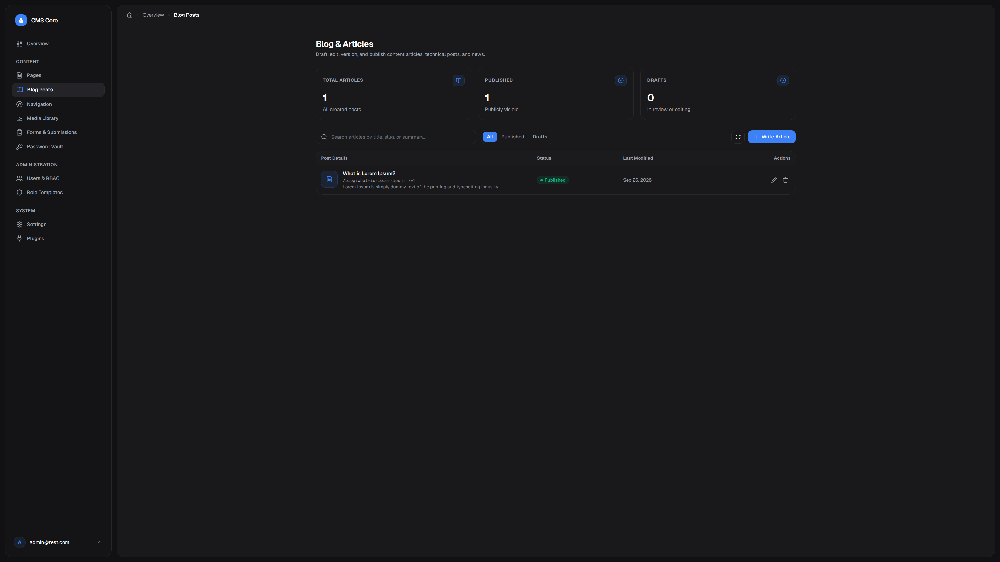<br><sub>Article listings and publication status</sub> | 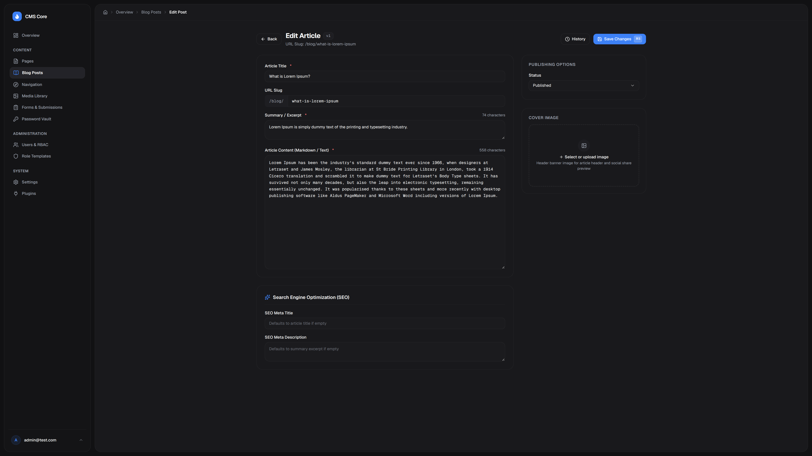<br><sub>Markdown editor and SEO metadata</sub> |

|                                           Password Vault                                            |                                                 Secret Details                                                 |
| :-------------------------------------------------------------------------------------------------: | :------------------------------------------------------------------------------------------------------------: |
| 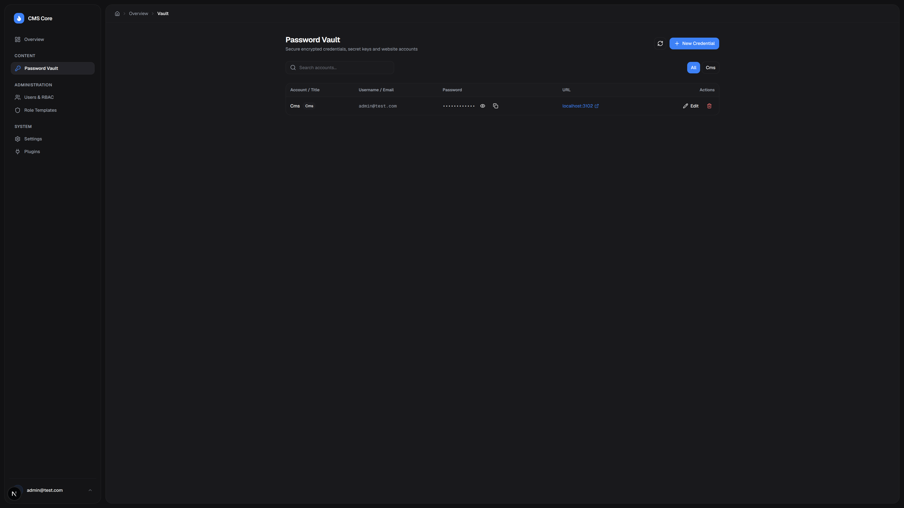<br><sub>Encrypted secrets manager and search</sub> | 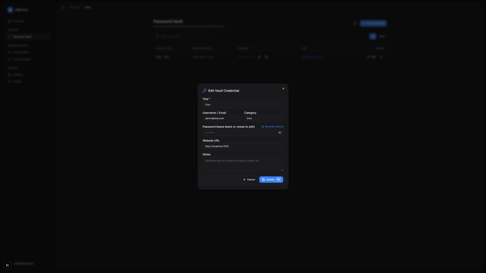<br><sub>Password generator and secret details</sub> |

|                                          Media Library                                           |                                            Brand Settings                                            |
| :----------------------------------------------------------------------------------------------: | :--------------------------------------------------------------------------------------------------: |
| 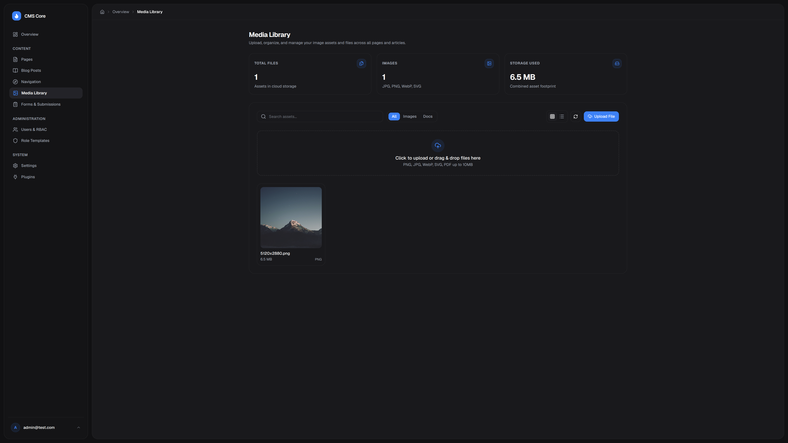<br><sub>Asset uploads and media management</sub> | 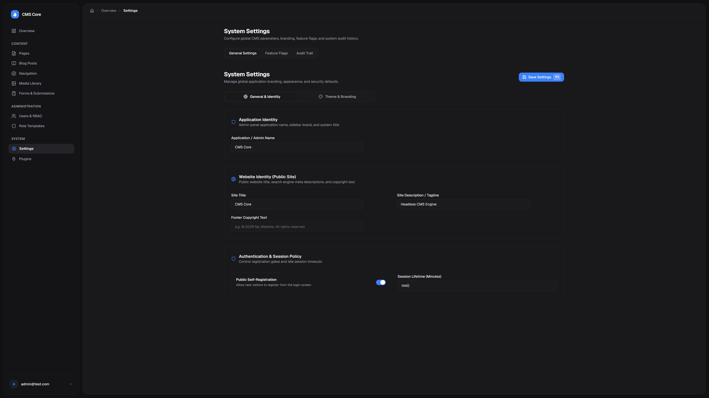<br><sub>Theme colors, typography, and logo</sub> |

### 🌐 Public Web Client (`client-template`)

|                                                 Homepage (Dark)                                                 |                                                    Homepage (Light)                                                     |
| :-------------------------------------------------------------------------------------------------------------: | :---------------------------------------------------------------------------------------------------------------------: |
| 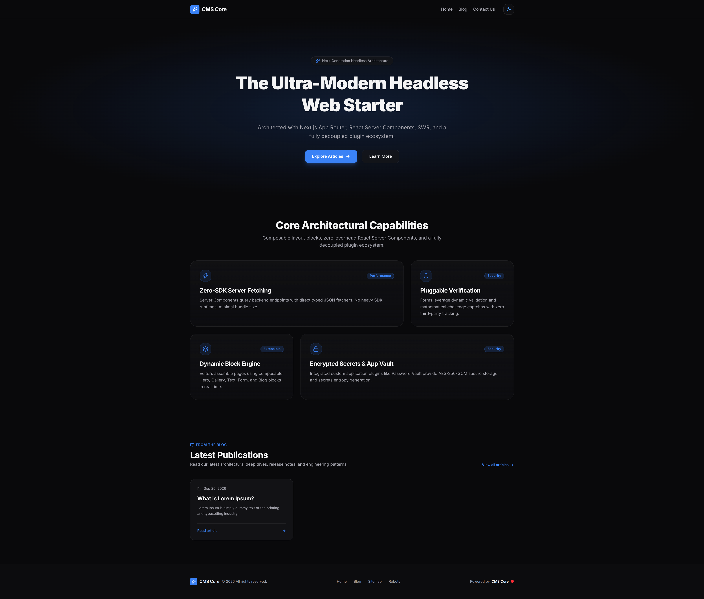<br><sub>Homepage with Bento grid (Dark mode)</sub> | 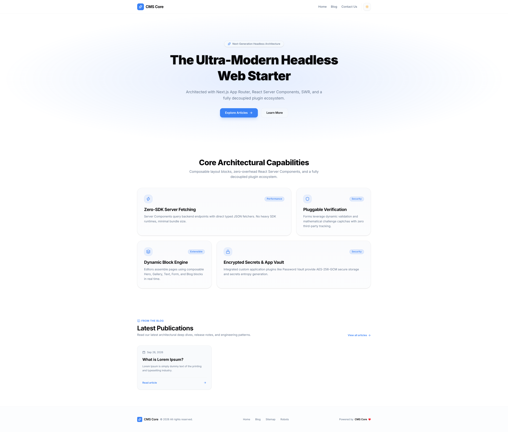<br><sub>Homepage with Bento grid (Light mode)</sub> |

|                                                Contact Page (Dark)                                                 |                                                    Contact Page (Light)                                                    |
| :----------------------------------------------------------------------------------------------------------------: | :------------------------------------------------------------------------------------------------------------------------: |
| 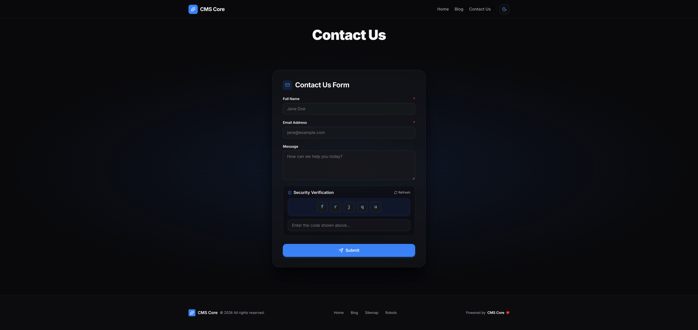<br><sub>Contact form with captcha (Dark mode)</sub> | 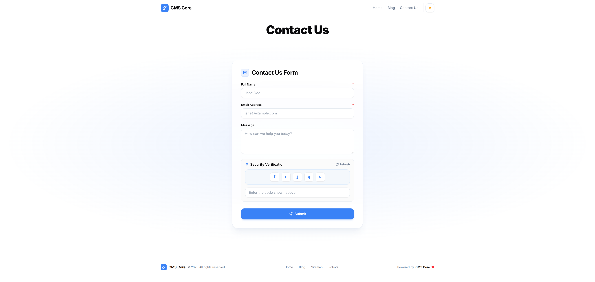<br><sub>Contact form with captcha (Light mode)</sub> |

---

## 🏗️ Architecture & Monorepo Structure

```text
cms/
├── packages/
│   ├── core/            ← Fastify 5 server, HookManager event bus, DI container
│   ├── db/              ← MongoDB 8 & Redis 8 adapters behind IDatabase / ICache
│   ├── admin-shell/     ← Shared React components, CVA design tokens, form primitives
│   └── client-sdk/      ← Public TypeScript types (PageDoc, BlogPostDoc) & fetchers
├── plugins/
│   ├── plugin-auth/     ← Authentication, RBAC, sessions, CSRF protection
│   ├── plugin-system/   ← Audit logs, feature flags, brand settings, plugin toggles
│   ├── plugin-pages/    ← Block-based page builder, version snapshots, 301 redirects
│   ├── plugin-blog/     ← Articles, slugs, author attribution, SEO metadata
│   ├── plugin-media/    ← S3/MinIO asset storage, MIME validation
│   ├── plugin-forms/    ← Form builder, challenge captcha, submission inbox, Excel/CSV export
│   └── plugin-vault/    ← AES-256-GCM encrypted password manager
├── cli/                 ← Project scaffolding CLI (cms new)
└── projects/            ← Generated projects (gitignored)
```

### Component Ownership

| Layer                                           | Distributed As            | Ownership & Maintenance                                                     |
| :---------------------------------------------- | :------------------------ | :-------------------------------------------------------------------------- |
| **Core Packages** (`core`, `db`, `admin-shell`) | Monorepo packages         | **Centrally maintained.** Updated across all projects via version bump.     |
| **Plugins** (`plugin-*`)                        | Modular 3-tier plugins    | **Centrally maintained.** Opt-in per project at creation or runtime.        |
| **Backend & Admin Runtime** (`api/`, `admin/`)  | Docker images / bootstrap | **Automated.** Pre-configured Fastify and Next.js admin runtimes.           |
| **Public Web Frontend** (`client-template/`)    | Starter template          | **Fully customizable.** Where your site design, pages, and components live. |

---

## 🧠 Key Technical Decisions

- **Fastify 5 + Zod 4.6:** High throughput with lower memory and CPU overhead compared to Express. All input payloads and environment variables are strictly validated with Zod, automatically powering interactive OpenAPI/Swagger docs at `/docs`.
- **Event Bus (`HookManager`):** Decoupled inter-plugin communication via publish/subscribe events (e.g. `blog.post.created` triggers audit logging). Plugins have zero circular dependencies and operate independently.
- **Client SDK (`@cms/client-sdk`):** Shared TypeScript contracts and fetchers guarantee end-to-end type safety between backend models and the Next.js frontend with zero code duplication.
- **Type-Safe UI (CVA Pattern):** UI primitives in `@cms/admin-shell` use Class Variance Authority for consistent design tokens, keyboard accessibility, and full autocomplete.
- **Hybrid SSR & Islands:** Next.js 16 Server Components handle static layout and SEO, while interactive elements (forms, captcha, modals) run as lightweight client islands with SWR cache revalidation.
- **Zero-Dependency Native Data Export:** `plugin-forms` implements RFC 4180 CSV (with `\uFEFF` UTF-8 BOM for immediate Turkish character decoding in Excel) and ECMA-376 OpenXML (`.xlsx`) using Node.js built-in `node:zlib` without third-party spreadsheet libraries.

---

## 🛡️ Security Architecture

- **Server-Side `PluginGuard`:** Ingress guard blocks direct API access to disabled plugins (`503 Service Unavailable`).
- **Session Security:** Cryptographically signed HttpOnly, SameSite cookies with sliding expiration and instant device revocation (`POST /api/auth/sessions/revoke-all`).
- **Double-Submit CSRF:** All state-changing requests (POST/PUT/DELETE) require a validated `crypto.randomBytes(32)` token.
- **AES-256-GCM Vault:** Secrets and credentials in `plugin-vault` are encrypted with AES-256-GCM using unique initialization vectors (IV).
- **Immutable Audit Logs:** Administrative actions (logins, settings changes, plugin toggles, user edits) are recorded permanently in MongoDB.

---

## 🧱 Web Client Block Engine (`client-template`)

The Next.js 16 public site features a modular, block-based page rendering engine connected through `@cms/client-sdk`:

| Block Type        | Component               | Description                                                                      |
| :---------------- | :---------------------- | :------------------------------------------------------------------------------- |
| **Hero Block**    | `HeroBlock.tsx`         | Full-width or split hero with badge, headline, CTA buttons, and background glow. |
| **Bento Grid**    | `BentoGridBlock.tsx`    | Modern asymmetric card grid with responsive columns and Lucide icons.            |
| **Rich Text**     | `TextBlock.tsx`         | Typography-optimized prose for markdown articles and legal documents.            |
| **Media Gallery** | `GalleryBlock.tsx`      | Responsive image and asset showcase with lightbox previews.                      |
| **Blog Feed**     | `BlogPostsBlock.tsx`    | Dynamic feed showing latest published articles, reading times, and tags.         |
| **Dynamic Form**  | `FormBlock.tsx`         | Embeds forms built in Admin with live validation and native challenge captcha.   |
| **Code Showcase** | `CodeShowcaseBlock.tsx` | Syntax-highlighted code snippets with one-click copy.                            |

**Frontend Highlights:**

- **Brand Token Sync:** Primary theme color (`--primary`) and Google Fonts configured in the Admin apply dynamically to the public site.
- **Native Challenge Captcha:** Lightweight math and character challenges protect forms without third-party tracking scripts or external cookies.

---

## ⚡ Quick Start

### Prerequisites

- **Node.js:** `>= 22.0.0 LTS` (tested on Node.js 26)
- **Docker & Docker Compose:** `>= 24.0`
- **npm:** `>= 10.0`

### 1. Setup & Run Locally

```bash
# Clone the repository
git clone https://github.com/kaan35/cms.git
cd cms

# Install dependencies
npm install

# Configure environment variables
cp .env.example .env

# Start all services with Docker (MongoDB, Redis, Fastify API, Admin Shell)
npm run dev
```

### 2. Access Endpoints

| Service          | URL                                                        | Notes                                 |
| :--------------- | :--------------------------------------------------------- | :------------------------------------ |
| **Admin Panel**  | [http://localhost:3002](http://localhost:3002)             | Manage content, plugins, and settings |
| **Setup Wizard** | [http://localhost:3002/setup](http://localhost:3002/setup) | Create initial Superadmin user        |
| **REST API**     | [http://localhost:3001](http://localhost:3001)             | Fastify backend API                   |
| **Swagger UI**   | [http://localhost:3001/docs](http://localhost:3001/docs)   | Interactive OpenAPI documentation     |

---

## 🚀 Scaffolding Projects with the CLI

The built-in CLI (`cli/bin/cms.js`) creates independent, production-ready projects in the `projects/` directory:

```bash
# Interactive setup wizard
node cli/bin/cms.js new my-site --interactive

# Or create a marketing site with public frontend
node cli/bin/cms.js new my-site --profile full --client --yes

# Or create a standalone internal tool (Admin-only, e.g. Vault / CRM)
node cli/bin/cms.js new my-tool --profile minimal --no-client --yes
```

### Scaffolded Project Commands

Each generated project has its own self-contained workflow:

```bash
cd projects/my-site

# Start in development mode (hot-reloads with local monorepo source)
npm run dev

# Start production containers
docker compose up -d

# Take a timestamped MongoDB backup
npm run db:backup

# Restore database from backup
npm run db:restore
```

---

## 🧪 Testing & Code Quality

```bash
# Run all automated tests across monorepo (200+ passing)
npm test

# Run TypeScript typechecks across all workspaces
npm run typecheck

# Run linter across workspaces
npm run lint

# Compile all packages
npm run build
```
